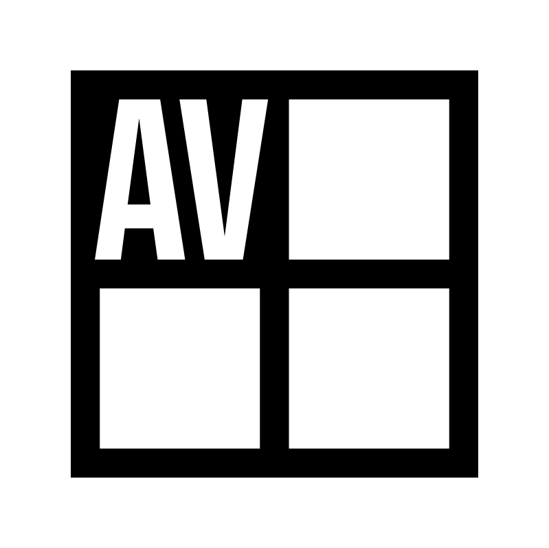
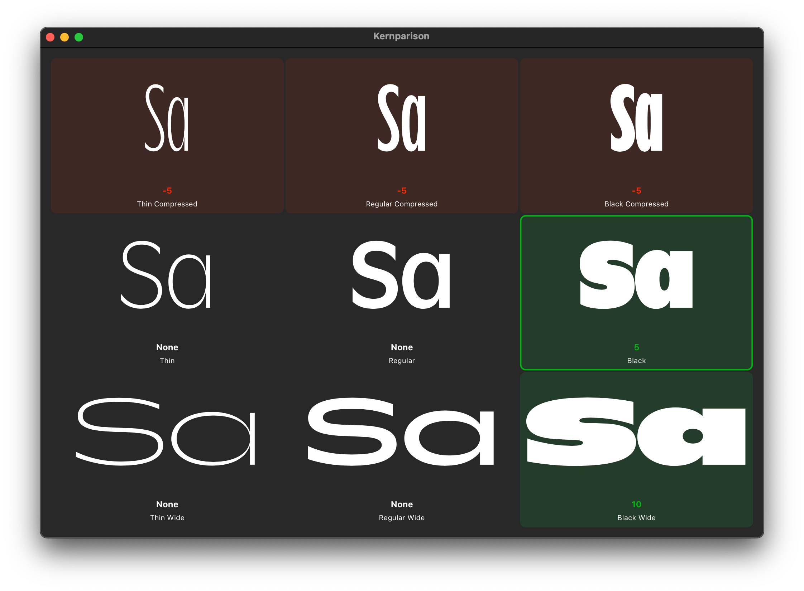

# Kernparison
A RoboFont extension for comparing how you kerned the current pair across your whole Designspace.

## Functionality

- Ability to view how kerning pairs were handled across all sources in a given designspace.
- An auto-updating preview.
	- As window is resized, Kernparison will make the most optimal layout for maximum visibility.
	- As you kern in Metrics Machine, Kernparison, will show that active pair. If the UFO you’re working on is one of the sources in Kernparison, it will update as you kern it.
	- Positive kerns are green. Negative kerns are red. 0 is neutral.
- Double-click a cell to open that UFO.
- Uses the current designspace you have open in Designspace Editor. If you don’t have a designspace open already, Kernparison will prompt you to choose a path to a designspace file.

© Ryan Bugden, 2025

## Acknowledgments

- Development of Kernparison sponsored by Hannes Famira.
- Built with RoboFont, EZUI, Merz, Subscriber. Thank you to Frederik Berlaen & Tal Leming.
