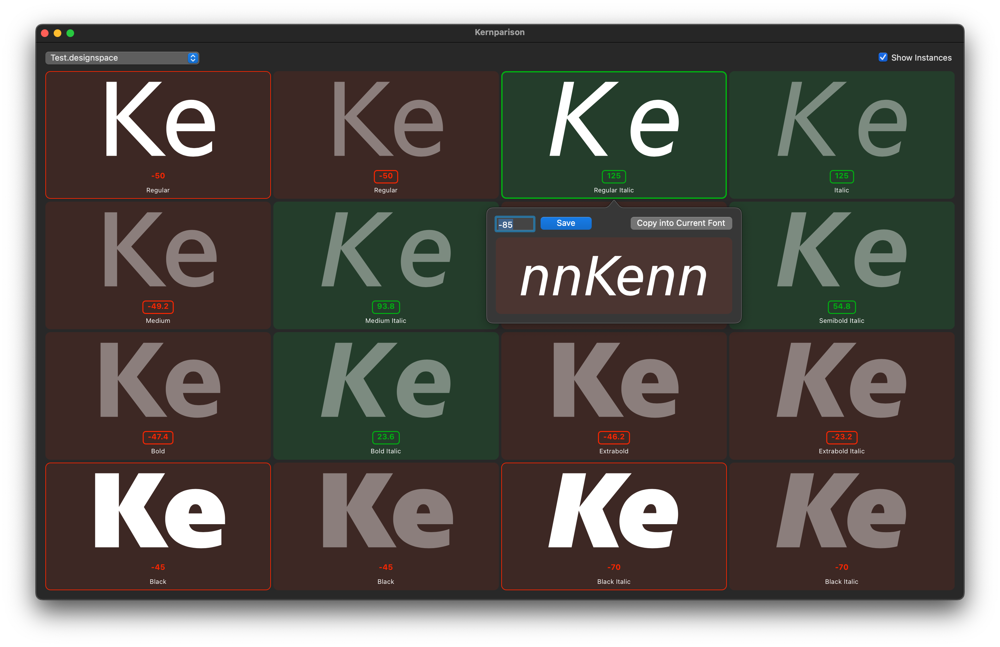

# Kernparison
A RoboFont extension for comparing how you kerned the current pair across your whole Designspace.

© Ryan Bugden, 2025

## How to Use

1. Open a UFO and MetricsMachine and get ready to start kerning.

2. Open Kernparison, and choose the desired designspace which corresponds to the UFO you are kerning.

3. All available sources in your chosen designspace should be displayed here. If you would like to show the instances too, click **Show Instances**.

4. Start working through your pairlist in MetricsMachine. Each time you change a pair, the Kernparison window should update automatically.

5. While kerning, check out the kerning decisions you made in other sources. 

6. Did you make a mistake in another source? Kernparison allows you to quickly change a kern value there too, without having to open the font.

   1. Right click (or control-click) the source’s cell. A little window should come up with a preview of the pair. You can quickly change the kerning pair in that other source. Want to remove the kern value from the kerning data? Clear the text field and click **Save**.

      > You must click **Save** to commit that kern value and save the source UFO. This will also update the preview of the source in Kernparison as well as all affected instances.
   
   3. You may also want to copy that kern value into your main kerning session. Clicking **Copy into Current Font** takes the value in the text box and applies that kern value to the current pair in the current font in RoboFont.

      > **Copy into Current Font** does not save the current font automatically.
   
7. Need to really get into that source bigtime? Double-click the cell to open the UFO and the current pair in MetricsMachine.

## Features, in detail

- Ability to view how kerning pairs were handled across all sources and instances in a given designspace.
- Ability to quickly change pair values across any source UFO in the designspace.
- A smart dropdown menu of all designspace files in the same folder.
- An auto-updating preview.
	- As window is resized, Kernparison will make the most optimal layout for maximum visibility. `Command –/+` makes the pairs smaller or larger.
	- As you kern in Metrics Machine, Kernparison, will show that active pair. If the UFO you’re working on is one of the sources in Kernparison, it will update as you kern it.
	- Positive kerns are green. Negative kerns are red. `0` or `None` is neutral.
	- Exceptions are indicated by the kerning value being outlined.
- Double-click a cell to open that UFO + MetricsMachine window, with the current pair.
- Right click a cell to quickly change and save another source’s kern value, or copy its kern value into your current font.

> [!NOTE]
> Kernparison will try to open a designspace in this order:
>
> 1. The current designspace you have open in Designspace Editor. 
> 2. Look at all designspace files in the same folder as your UFO. Look for the first of those files which features your UFO as a source.
> 3. A prompt for you to choose a path to a designspace file.

## Acknowledgments

- Hannes Famira, for the idea behind this extension, and the initial sponsorship for its development.
- Built with RoboFont, EZUI, Merz, Subscriber. Thank you to Frederik Berlaen & Tal Leming.
